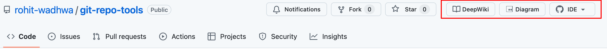
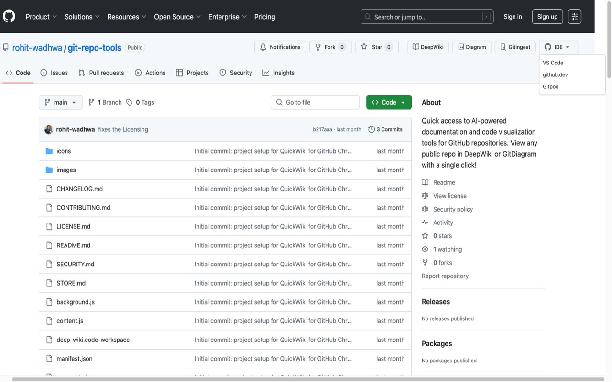
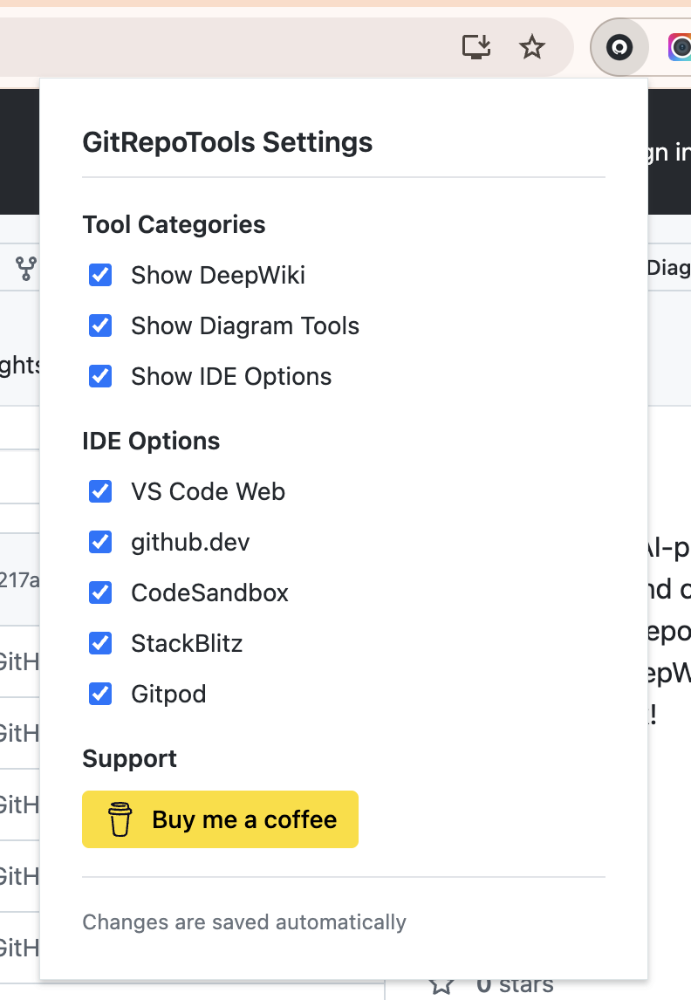

# GitRepoTools


A Chrome extension that adds quick access buttons to view GitHub repositories in DeepWiki and GitDiagram, with additional WebIDE integration.

**⚠️ DISCLAIMER: This is an unofficial extension and is not affiliated with DeepWiki, GitDiagram, or their respective companies in any way.**

## Browser Compatibility

- Chrome (latest) - Recommended
- Microsoft Edge (Chromium-based)
- Brave, Vivaldi (Chromium-based browsers)

## Screenshots

### Main Interface

*Quick access buttons integrated into GitHub's interface*

### IDE Options

*Multiple WebIDE options available in the dropdown*

### Settings

*Customize which tools and options are displayed*

## Features

✨ **Enhanced GitHub Integration**
- Seamlessly integrates with GitHub's interface
- Dark mode support that follows GitHub's theme
- Responsive design for mobile and desktop
- Accessibility features (keyboard navigation, screen reader support)

🛠️ **Multiple Tool Integration**
- **DeepWiki** button for AI-powered documentation (online service)
- **GitDiagram** button for code visualization (online service)  
- **Gitingest** button to generate prompt-friendly text digest (online service)
- **WebIDE** dropdown with multiple options:
  - VS Code Web
  - github.dev
  - CodeSandbox
  - StackBlitz
  - Gitpod

⚙️ **Customizable Settings**
- Toggle individual buttons on/off
- Customize WebIDE options
- Reset to defaults functionality
- Auto-save with visual feedback
- Loading states and error handling

## Installation

### Prerequisites
- Chrome 88+ or compatible Chromium-based browser
- Developer mode enabled for unpacked extensions

### Steps
1. Download or clone this repository
2. Open Chrome and navigate to `chrome://extensions/`
3. Enable "Developer mode" toggle in the top right corner
4. Click "Load unpacked" button
5. Select the directory containing the extension files
6. The extension will appear in your extensions list and be ready to use

### Verification
After installation, you should see:
- GitRepoTools icon in your browser toolbar
- Quick access buttons on any GitHub repository page

## Usage

### Basic Usage
1. Visit any GitHub repository page (e.g., `https://github.com/username/repository`)
2. Look for the GitRepoTools buttons integrated into GitHub's interface
3. Click any button to access the respective service:
   - **DeepWiki**: AI-powered repository documentation
   - **GitDiagram**: Visual code architecture diagrams
   - **Gitingest**: Prompt-friendly repository text digest
   - **IDE**: Dropdown menu with multiple WebIDE options

### Settings Management
1. Click the GitRepoTools extension icon in your browser toolbar
2. Toggle tools on/off as needed
3. Customize which WebIDE options appear
4. Use "Reset to Defaults" to restore original settings
5. All changes save automatically

## Compatibility

### Repository Types
- ✅ Public repositories (all features)
- ✅ Private repositories (WebIDE features only)
- ✅ Organization repositories
- ✅ Forked repositories

### GitHub Pages
- Repository home pages
- File browser pages  
- README preview pages
- Release pages

## Development

### Project Structure
```
git-repo-tools/
├── manifest.json          # Extension configuration
├── popup.html             # Settings interface
├── popup.js              # Settings logic
├── content.js            # Main content script
├── content.css           # Styling
├── background.js         # Background service worker
└── icons/               # Extension icons
```

### Key Features Implemented
- **Manifest V3** compliance for future Chrome compatibility
- **Dark mode** support using GitHub's CSS variables
- **Accessibility** features (ARIA labels, keyboard navigation)
- **Error handling** with user feedback
- **Performance optimization** with efficient DOM manipulation
- **Responsive design** for various screen sizes

### Testing
Before publishing, test on:
- Different GitHub repository types
- Various screen sizes and zoom levels
- Light and dark themes
- With different browser extensions installed
- Slow network connections

## Privacy & Security

### Data Collection
- **No personal data** is collected or transmitted
- **No tracking** or analytics
- **No external API calls** from the extension itself
- Settings stored locally using Chrome's sync storage

### Permissions Used
- `activeTab`: Access current GitHub tab to inject buttons
- `storage`: Save user preferences
- `host_permissions`: GitHub.com access only

## Support

If you find this extension useful, consider supporting development:

[](https://buymeacoffee.com/rohit.wadhwa)

## Troubleshooting

### Common Issues

**Buttons not appearing:**
- Refresh the GitHub page
- Check if extension is enabled
- Verify you're on a repository page (not user profile)

**Settings not saving:**
- Check Chrome storage permissions
- Disable other extensions temporarily to test for conflicts

**Dark mode issues:**
- Clear browser cache
- Update to latest Chrome version

### Getting Help
- Open an issue on [GitHub](https://github.com/rohit-wadhwa/git-repo-tools)
- Email: [rohit.wadhwa52@gmail.com](mailto:rohit.wadhwa52@gmail.com)

## Contributing

Contributions are welcome! Please:
1. Fork the repository
2. Create a feature branch
3. Test thoroughly
4. Submit a pull request

## Legal

This extension is not affiliated with, endorsed by, or connected to DeepWiki, GitDiagram, GitHub, or their respective companies. All trademarks belong to their respective owners. This is an independent tool created to enhance the GitHub browsing experience.

## License

MIT License - see LICENSE.md for details

---

**Version:** 1.0  
**Last Updated:** 2024  
**Minimum Chrome Version:** 88 
